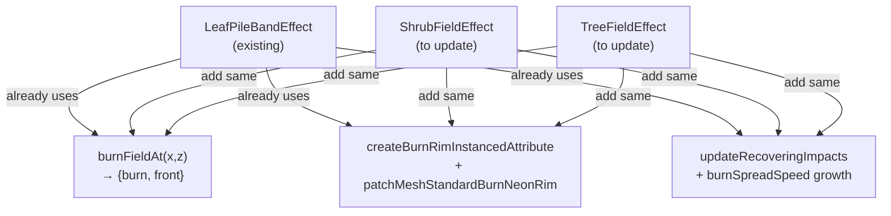

# Foliage Crown Burns

Add spreading, recovering burns to shrub and tree crown leaf meshes, matching the leaf pile model exactly.

## Architecture




## Key files

- `[src/weft/three/presets/shrubField.ts](src/weft/three/presets/shrubField.ts)` — primary edit
- `[src/weft/three/presets/treeField.ts](src/weft/three/presets/treeField.ts)` — primary edit
- `[src/weft/three/presets/burnNeonRim.ts](src/weft/three/presets/burnNeonRim.ts)` — already has everything needed, no changes
- `[src/playground/PlaygroundRuntime.ts](src/playground/PlaygroundRuntime.ts)` — wire up new API

---

## Step 1 — Add burn params to `ShrubFieldParams` and `TreeFieldParams`

In `shrubField.ts`, extend `ShrubFieldParams`:

```ts
burnRadius: number
burnSpreadSpeed: number
burnMaxRadius: number
recoveryRate: number
```

Add matching defaults to `DEFAULT_SHRUB_FIELD_PARAMS` (mirror leaf pile values, slightly tighter for foliage).

Same additions to `TreeFieldParams` / `DEFAULT_TREE_FIELD_PARAMS` in `treeField.ts` (separate from the existing `trunkBurn*` params which stay on the bark surface).

---

## Step 2 — Add burn state to `ShrubFieldEffect`

- Import `updateRecoveringImpacts` from `../../runtime` and `createBurnRimInstancedAttribute`, `patchMeshStandardBurnNeonRim` from `./burnNeonRim`.
- Add `private readonly burns: LeafPileBurn[]` (same shape: `{x, z, radius, maxRadius, strength}`).
- Add `private lastElapsed = 0` for delta tracking.
- Change `leafMesh.instanceMatrix.setUsage` to `DynamicDrawUsage` (burns require per-frame rebuild).
- Create `leafBurnRimAttr` and attach it to `leafGeometry` as `'burnRim'`.
- Call `patchMeshStandardBurnNeonRim(this.leafMaterial, 'shrub-leaf')`.
- Add public methods: `addBurnFromWorldPoint()`, `clearBurns()`, `hasBurns()` — identical logic to leaf pile.
- Add `private burnFieldAt()` — copy verbatim from leaf pile (pure math, no dependencies).
- Change `update(getGroundHeight)` signature to `update(elapsedTime, getGroundHeight)`.
  - Grow burn radii and call `updateRecoveringImpacts` each frame when `delta > 0`.
  - Always rebuild when `hasBurns()` (already rebuilds every call, so no cadence change needed in the effect itself).
- In `projectLine`, per-instance: sample `burnFieldAt(x, z)`, modulate `setColorAt` with a foliage burn color function (same ember→ash transitions as `leafColor` in leaf pile), set `leafBurnRimAttr`.

---

## Step 3 — Add burn state to `TreeFieldEffect` crown

Same additions as shrubs, but targeting `crownLeafMesh` / `crownLeafMaterial`:

- `crownLeafMesh` switches to `DynamicDrawUsage`.
- `crownLeafBurnRimAttr` attached to `crownLeafGeometry` as `'burnRim'`.
- `patchMeshStandardBurnNeonRim(this.crownLeafMaterial, 'tree-crown-leaf')`.
- `burns` array, `burnFieldAt`, `addBurnFromWorldPoint`, `clearBurns`, `hasBurns` — same as shrubs.
- Crown burn params use the new `TreeFieldParams` fields (not the existing `trunkBurn*` ones).
- `update()` already takes `elapsedTime`; add burn spread + recovery there alongside the existing trunk bark update.
- In `projectLine`, sample burn field at the crown world position `(x, groundY + trunkHeight)` projected back to XZ `(x, z)` — the burn field is XZ-planar so the same `burnFieldAt(x, z)` call works.
- Modulate `crownLeafMesh.setColorAt` and set `crownLeafBurnRimAttr`.

---

## Step 4 — Wire into `PlaygroundRuntime`

**New stamp method:**

```ts
private stampFoliageBurn(point: THREE.Vector3): void {
  this.shrubFieldEffect.addBurnFromWorldPoint(point, { radiusScale: 0.9, maxRadiusScale: 1.1, strength: 0.88, mergeRadius: 0.65 })
  this.shrubFieldDirty = true
  this.treeFieldEffect.addCrownBurnFromWorldPoint(point, { radiusScale: 1.1, maxRadiusScale: 1.3, strength: 0.82, mergeRadius: 0.8 })
  this.treeFieldDirty = true
}
```

**Call sites** — add `this.stampFoliageBurn(point)` alongside the existing `stampLeafPileBurn` calls (ground hit ~line 2927, fallback hit ~line 2893).

**Update loop** — change the shrub update block (line 3208) to pass `elapsed` and use the same `hasBurns` cadence pattern as leaf pile:

```ts
const shrubHasBurns = this.shrubFieldEffect.hasBurns()
const shrubCadence = shrubHasBurns ? this.cadenceFor('shrub') : this.idleCadenceFor('shrub')
if ((shrubHasBurns || this.shrubFieldDirty) && this.shouldRunCadencedUpdate(shrubCadence, 1)) {
  this.shrubFieldEffect.update(elapsed, this.getGroundHeightAtWorld)
  this.shrubFieldDirty = shrubHasBurns
}
```

Tree update already has a cadence block — extend it to also check `treeFieldEffect.hasCrownBurns()`.

**Clear methods** — add `clearShrubBurns()` and `clearTreeCrownBurns()`, call both from `clearAllEffects()`.