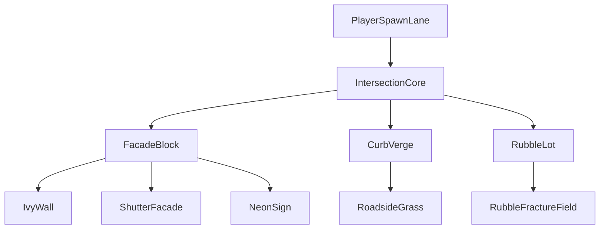

# Town Edge Playground

## Goal
Transform the current open playground into a **stylized night intersection at the edge of town** and add five new reactive examples that feel like one coherent scene:
- ivy wall
- shutter or slatted facade
- curbside grass or weeds
- neon sign surface
- rubble field with fracture-style reactions instead of generic explosion

The point is not just to add more effects, but to make the repo read as **one runtime, many reactive surfaces, same source -> layout -> effect model**.

## Current Spine To Build On
The existing playground is centralized in:
- [c:\WebProjects\pretext-three-experiment\src\playground\PlaygroundRuntime.ts](c:\WebProjects\pretext-three-experiment\src\playground\PlaygroundRuntime.ts)
- [c:\WebProjects\pretext-three-experiment\src\playground\playgroundWorld.ts](c:\WebProjects\pretext-three-experiment\src\playground\playgroundWorld.ts)
- [c:\WebProjects\pretext-three-experiment\src\playground\playgroundEnvironment.ts](c:\WebProjects\pretext-three-experiment\src\playground\playgroundEnvironment.ts)
- [c:\WebProjects\pretext-three-experiment\src\Editor.tsx](c:\WebProjects\pretext-three-experiment\src\Editor.tsx)

Right now the world is still mostly a grass-defined ground with mounted effect groups. The cleanest path is to keep `PlaygroundRuntime` as the orchestration layer, move scene layout constants into `playgroundWorld.ts`, and add a dedicated environment builder for roads, curbs, buildings, and props.

## Recommended Build Order
1. Reframe the environment first.
- Expand the world constants in [c:\WebProjects\pretext-three-experiment\src\playground\playgroundWorld.ts](c:\WebProjects\pretext-three-experiment\src\playground\playgroundWorld.ts) to describe an intersection footprint, building anchors, sign positions, verge strips, and rubble zones.
- Add static scene dressing helpers under `src/playground` for asphalt, road stripes, curbs, sidewalks, streetlights, simple building masses, and edge-of-town silhouettes.
- Shift atmosphere and lighting in [c:\WebProjects\pretext-three-experiment\src\playground\playgroundEnvironment.ts](c:\WebProjects\pretext-three-experiment\src\playground\playgroundEnvironment.ts) toward stylized night readability: stronger color separation, cooler fog, warmer street lighting, and more dramatic sky balance.

2. Separate terrain roles so the intersection is believable.
- Keep the current grass-driven height logic where useful, but make roads and sidewalks flatter and visually distinct.
- Update grounding in [c:\WebProjects\pretext-three-experiment\src\playground\PlaygroundRuntime.ts](c:\WebProjects\pretext-three-experiment\src\playground\PlaygroundRuntime.ts) so player walk height can combine road, curb, and verge assumptions instead of reading only from the grass field.
- Prevent the existing rock field from scattering through the roadway by introducing zone masks or by replacing the current rock placement with a scene-aware rubble effect.

3. Add the five new examples as scene-native surfaces.
- **Ivy wall**: reactive facade growth that opens up under hits and regrows over time.
- **Shutter/facade slats**: a woundable wall-like surface for windows or storefront panels.
- **Curb grass/weeds**: a denser roadside grass strip that shows trampling and recovery in a more urban context.
- **Neon sign**: a semantic/stateful sign surface that can break, flicker, and recover instead of behaving like a plain sprite.
- **Rubble fracture field**: replace “exploding rocks” with a more Weft-native fractured density response near empty lots or curbs.

4. Extend interaction and editor wiring.
- Update raycast targeting and shot handling in [c:\WebProjects\pretext-three-experiment\src\playground\PlaygroundRuntime.ts](c:\WebProjects\pretext-three-experiment\src\playground\PlaygroundRuntime.ts) so the new facade, sign, ivy, and rubble surfaces can all be targeted.
- Add grouped controls in [c:\WebProjects\pretext-three-experiment\src\Editor.tsx](c:\WebProjects\pretext-three-experiment\src\Editor.tsx) for the new effects without turning the panel into noise. Prefer scene-oriented sections like `Intersection`, `Facade`, `Sign`, `Roadside`, `Rubble`.
- Extend clear/reset flows so every new effect has a reliable cleanup path.

5. Refresh docs so the new scene explains the SDK.
- Update [c:\WebProjects\pretext-three-experiment\README.md](c:\WebProjects\pretext-three-experiment\README.md) and [c:\WebProjects\pretext-three-experiment\src\Docs.tsx](c:\WebProjects\pretext-three-experiment\src\Docs.tsx) to describe the new town-edge scene and why each new effect demonstrates layout-driven reactivity better than generic destruction.

## Effect Mapping Strategy
Use the existing presets/helpers wherever possible so this remains a real SDK showcase rather than bespoke scene code:
- ivy wall: adapt wall-style layout and recovery patterns from the existing wall-oriented effects
- shutter facade: likely closest to `createFishScaleEffect()` behavior, but visually restyled for slats/panels
- curb grass: extend the current grass effect or instantiate a second grass-like surface with different placement bounds
- neon sign: build on semantic palettes and state behavior from the `three` API instead of ad hoc meshes
- rubble fracture: start from the current rock field path, but constrain it to zones and react by thinning/opening rather than “physics explosion”

## Scene Layout Sketch

## Likely File Changes
Primary files:
- [c:\WebProjects\pretext-three-experiment\src\playground\PlaygroundRuntime.ts](c:\WebProjects\pretext-three-experiment\src\playground\PlaygroundRuntime.ts)
- [c:\WebProjects\pretext-three-experiment\src\playground\playgroundWorld.ts](c:\WebProjects\pretext-three-experiment\src\playground\playgroundWorld.ts)
- [c:\WebProjects\pretext-three-experiment\src\playground\playgroundEnvironment.ts](c:\WebProjects\pretext-three-experiment\src\playground\playgroundEnvironment.ts)
- [c:\WebProjects\pretext-three-experiment\src\Editor.tsx](c:\WebProjects\pretext-three-experiment\src\Editor.tsx)
- [c:\WebProjects\pretext-three-experiment\README.md](c:\WebProjects\pretext-three-experiment\README.md)
- [c:\WebProjects\pretext-three-experiment\src\Docs.tsx](c:\WebProjects\pretext-three-experiment\src\Docs.tsx)

Expected new modules:
- scene/environment builders under `src/playground` for roads, curbs, buildings, lights, and props
- one or more new effect/preset modules under `src/weft/three/presets` if the current presets cannot be cleanly restyled in place

## Success Criteria
- the playground reads immediately as a stylized night town-edge intersection
- the new examples feel spatially coherent instead of scattered around an empty field
- at least five reactive surfaces are visible and targetable in one scene
- each new example demonstrates layout, thinning, wounds, recovery, or state change more clearly than generic destruction
- the docs explain why the scene is a stronger showcase for Weft than the previous isolated playground