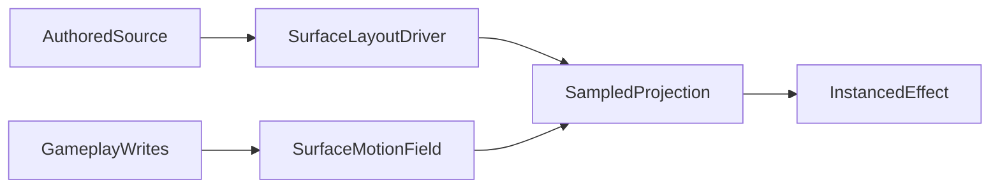

# Weft Native Physics

## Goal

Add a reusable SDK-level, Weft-native "physics without objects" layer based on persistent motion fields.

This should let authored surfaces like logs and stick bundles:

- persistently move after interaction
- stay inside the `source -> layout -> effect` model
- respond to gameplay through field writes and sampled state, not a separate object simulation pipeline

## Chosen Direction

Use **persistent motion fields**, not per-object bodies.

- Gameplay writes to persistent runtime fields such as displacement, flow, occupancy, and angular bias.
- Presets sample those fields at their authored layout positions during projection.
- Layout still decides what exists; the motion field decides how authored content is advected, spread, blocked, or rotated over time.

## Architecture

### New SDK primitive

Add a reusable runtime abstraction in [c:\WebProjects\pretext-three-experiment\src\weft\runtime](c:\WebProjects\pretext-three-experiment\src\weft\runtime) for persistent surface motion state.

Likely pieces:

- `createSurfaceMotionField()`
- field storage over surface/world coordinates
- write operations for impulses / pushes / drag / occupancy
- update step for decay, advection, friction, and persistence
- sampling API returning:
  - displacement vector
  - flow vector
  - occupancy / settled mass
  - angular or tangential bias

### How presets use it

- `logField` samples persistent motion/occupancy fields to shift and rotate authored logs over time.
- `stickField` samples the same family of fields but interprets them as more distributive bundle motion and spread.
- Other presets can stay on simpler disturbance/burn systems until needed.

## Planned Changes

1. Add the motion-field runtime primitive.

- Create new runtime module(s) under [c:\WebProjects\pretext-three-experiment\src\weft\runtime](c:\WebProjects\pretext-three-experiment\src\weft\runtime).
- Keep it generic enough for logs/sticks first, but not over-generalized beyond current needs.
- Export from [c:\WebProjects\pretext-three-experiment\src\weft\runtime\index.ts](c:\WebProjects\pretext-three-experiment\src\weft\runtime\index.ts).

1. Refactor `logField` to sample persistent motion fields.

- Update [c:\WebProjects\pretext-three-experiment\src\weft\three\presets\logField.ts](c:\WebProjects\pretext-three-experiment\src\weft\three\presets\logField.ts).
- Replace the temporary impulse-only roll/settle model with sampled persistent displacement/flow/rotation state.
- Keep logs authored by layout, but make their projected transforms come from persistent field samples.

1. Refactor `stickField` to sample the same primitive differently.

- Update [c:\WebProjects\pretext-three-experiment\src\weft\three\presets\stickField.ts](c:\WebProjects\pretext-three-experiment\src\weft\three\presets\stickField.ts).
- Interpret motion fields as bundle spread/scatter/drag rather than heavy rigid rolling.
- Preserve the current bundle-style visual read.

1. Wire gameplay writes from the demo runtime.

- Update [c:\WebProjects\pretext-three-experiment\src\playground\PlaygroundRuntime.ts](c:\WebProjects\pretext-three-experiment\src\playground\PlaygroundRuntime.ts) so footsteps, player pushes, and shots write into the motion field instead of directly mutating per-preset transient arrays.
- Keep existing burn/disturbance systems for leaves and needles unless they also benefit from the motion primitive.

1. Expose and document the system.

- Add minimal tuning controls in [c:\WebProjects\pretext-three-experiment\src\SceneryDemo.tsx](c:\WebProjects\pretext-three-experiment\src\SceneryDemo.tsx) for motion persistence / drag / push strength if needed.
- Add a small Docs example in [c:\WebProjects\pretext-three-experiment\src\Docs.tsx](c:\WebProjects\pretext-three-experiment\src\Docs.tsx) if the primitive lands cleanly.

## Design Rules

- Do not introduce free-moving scene objects for logs/sticks.
- Do not let gameplay bypass layout entirely.
- Keep persistence in sampled field state, not ad hoc per-instance arrays keyed only to current frame layout.
- Use deterministic seeds and stable authored positions as the baseline; motion fields should be a persistent deformation/advection layer on top.

## Verification

- Run `npm run build:demo`
- Check diagnostics on all edited runtime/preset/demo files
- In `Scenery`, verify:
  - pushed logs keep their new positions over time
  - repeated pushes keep accumulating through persistent field state
  - stick bundles spread/shift persistently rather than only briefly fluttering
  - behavior still feels layout-driven rather than object-sim driven

