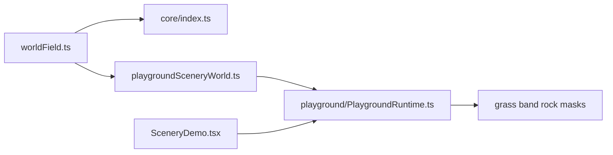

# Implement Deterministic World Fields

## Goal

Add a first-class Weft primitive for seeded scalar world fields, then use it to replace the hand-authored scenery shaping logic with deterministic organic variation that still feeds Weft's existing `source -> layout -> effect` model.

## Architecture

## API Shape

Create a new core module at [c:\WebProjects\pretext-three-experiment\src\weft\core\worldField.ts](c:\WebProjects\pretext-three-experiment\src\weft\core\worldField.ts) that exposes a small scalar-field surface:

- `WorldField2` type: `(x: number, z: number) => number`
- deterministic factory like `createWorldField(seed, options)`
- composable helpers for the first pass:
  - hash/value noise sampler
  - fbm combiner
  - ridge transform
  - threshold/remap helpers
  - optional domain warp helper
- keep it pure and allocation-free inside hot sample paths

Match existing core naming/export style from [c:\WebProjects\pretext-three-experiment\src\weft\core\index.ts](c:\WebProjects\pretext-three-experiment\src\weft\core\index.ts) and existing deterministic primitives like `seedCursor()` / `createBandSeeds()`.

## Implementation Steps

1. Add `worldField.ts` in `src/weft/core`.
  Include deterministic hash/noise building blocks that are currently duplicated locally across presets.
2. Export the new public API from [c:\WebProjects\pretext-three-experiment\src\weft\core\index.ts](c:\WebProjects\pretext-three-experiment\src\weft\core\index.ts).
  This automatically makes it available through both `weft-sdk/core` and the root `weft-sdk` barrel.
3. Refactor Scenery authoring in [c:\WebProjects\pretext-three-experiment\src\playground\playgroundSceneryWorld.ts](c:\WebProjects\pretext-three-experiment\src\playground\playgroundSceneryWorld.ts).
  Keep the current authored trails / clearings as the strong structure, but blend in the new world field to drive:
  - grass `coverageMultiplierAtXZ`
  - understory band shoulder wobble / membership
  - leaf litter density/shape variation
  - rock cluster inclusion thresholds
4. Add minimal runtime support in [c:\WebProjects\pretext-three-experiment\src\playground\PlaygroundRuntime.ts](c:\WebProjects\pretext-three-experiment\src\playground\PlaygroundRuntime.ts).
  Because grass/band/rock masks are evaluated during rebuilds, add a narrow invalidation path so field-related parameter changes mark:
  - grass layout/cache dirty
  - verge/leaf/rock dirty
   Avoid per-frame field re-evaluation unless explicitly needed.
5. Expose the field in [c:\WebProjects\pretext-three-experiment\src\SceneryDemo.tsx](c:\WebProjects\pretext-three-experiment\src\SceneryDemo.tsx).
  Add a compact `World field` section with only a few high-value knobs such as:
  - `seed`
  - `scale`
  - `strength`
  - `warp` or `roughness`
  - optional toggles for affecting grass / floor / rocks
6. Update docs/examples if needed.
  Add one concise example to [c:\WebProjects\pretext-three-experiment\src\Docs.tsx](c:\WebProjects\pretext-three-experiment\src\Docs.tsx) showing the intended usage pattern: sample a field, then feed it into placement-mask callbacks rather than using it as a separate scatter system.

## Key Integration Notes

Use existing hooks instead of inventing a new preset contract first:

- Grass already supports continuous density through `coverageMultiplierAtXZ`.
- Band and leaf presets already accept `distanceToBandAtXZ` / `includeAtXZ`.
- Rock currently only has boolean inclusion, so threshold the scalar there.

The important runtime caveat is that these masks are not sampled every frame. Field-driven UI controls therefore need rebuild invalidation rather than just changing a closure value.

## Validation

- Typecheck with `npx tsc --noEmit`
- Verify Scenery controls visibly rebuild grass / understory / litter / rocks
- Check profiler impact in both low and high quality
- Confirm deterministic output: same seed should reproduce the same world pattern across reloads

