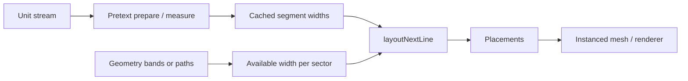

# Pretext Weft

Pretext Weft is a prototype **surface-layout engine** for games and interactive 3D. The core move is:

- prepare a measured stream of units
- derive changing widths from geometry
- run deterministic layout
- project the result back onto the surface as instanced geometry

This is not really a “text on a torus” demo. The larger claim is that **text-layout ideas can become a runtime primitive for authored surface decoration**: symbols, scales, paneling, inscriptions, ornament, or modular skin that reflows when a mesh deforms or gameplay changes the available space.

## Why Pretext

Most procedural surface detail in games comes from one of these buckets:

- hand placement
- baked textures
- decals
- random scatter / noise
- custom one-off packing logic

Those approaches can look good, but they do not behave like authored layout. [Pretext](https://www.npmjs.com/package/@chenglou/pretext) already solves a hard part of the problem:

- segmentation
- measurement
- deterministic line breaking
- fast reflow against changing widths

Pretext Weft uses that 1D layout machinery as the **core engine primitive**, then maps it onto 3D surfaces.

## Thesis

Treat the surface like a page.

- A band, contour, or path on a mesh becomes a line.
- Arc length or authored masks become available width.
- Wounds, vents, seams, and obstacles reduce that width.
- Pretext decides what fits.
- A renderer places the chosen units back onto the surface.

That changes the problem from “scatter some meshes on a model” to “run a deterministic layout pass on a surface.”

## Why this could matter for web games

If this approach matures, web games get a new class of runtime-authored visuals:

- armor or creature skin that reflows instead of stretching a baked decal
- magical inscriptions that route around damage or openings
- ornamental surfaces that stay ordered, not noisy
- diegetic symbols or UI embedded into geometry
- authorable procedural detail with stable, reproducible behavior

The value is not just visual novelty. It is a better **authoring model**:

- less manual placement
- more reactive content
- deterministic results
- reusable rules instead of one-off scatter systems and shaders

## Current architecture

This repo now treats the demo as a thin shell around a plain runtime:

- **React** is only used for the app shell, controls, and landing page.
- **Three.js + WebGPU** run the actual playground renderer.
- **No React Three Fiber** is used in the demo runtime.
- **Plain TypeScript** owns scene setup, layout passes, placement, and animation.

That separation matters because the engine concept should be portable beyond React.

## Pipeline



1. **Prepare**  
   Build a unit stream and let Pretext measure it once.

2. **Sample geometry**  
   Convert a band or path on the mesh into sectors with available width.

3. **Layout**  
   Start from a stable seeded cursor for each band and run `layoutNextLine()` against each sector width.

4. **Project**  
   Turn the chosen units into positions, orientations, and scales on the surface.

5. **Render**  
   Feed those placements to a renderer, currently via Three.js `InstancedMesh`.

## Playground samples

- **Torus + wound**  
  A contour-band layout field wrapped onto a torus. Width changes come from arc length and a wound region.

- **Plane ribbons**  
  A simpler reference case: flat bands with a width-cutting obstacle using the same Pretext-driven layout pass.

These are intentionally simple. They exist to validate the engine idea, not to be the final art style.

## Quick start

Requirements: Node.js 20+ recommended.

```bash
npm install
npm run dev
```

Open the Vite URL in a **WebGPU-capable** browser.

Important:

- The playground is **WebGPU only**.
- Three.js WebGL fallback is disabled.
- If WebGPU is unavailable, the playground should fail instead of silently switching APIs.

Build for production:

```bash
npm run build
npm run preview
```

## Project structure

```text
src/
  App.tsx                     React shell
  Landing.tsx                 Product framing / thesis
  Editor.tsx                  Controls + runtime host
  skinText.ts                 Pretext stream preparation and seeded cursors
  playground/
    PlaygroundRuntime.ts      Plain Three.js/WebGPU runtime
    torusSample.ts            Torus layout + placement logic
    ribbonSample.ts           Ribbon layout + placement logic
    types.ts                  Runtime-facing sample params
  samples/
    sampleMeta.ts             Sample copy for the UI
    graphemes.ts              Shared grapheme splitting helper
```

## What this is not yet

- not a packaged engine
- not an editor workflow
- not a general band-authoring tool
- not a game-engine integration layer

Right now this repo is a **reference prototype**: enough to prove the layout model, runtime shape, and rendering direction.

## Next steps

- extract a true `core` surface-layout package
- define placement/output data structures independent of Three.js
- support more surface parameterizations than the current two samples
- add authoring tools for width masks, bands, paths, and streams
- explore export/runtime stories for game engines

## Credits

- Layout and measurement: [Pretext](https://www.npmjs.com/package/@chenglou/pretext)
- Rendering: [Three.js](https://threejs.org/)

## License

[MIT](LICENSE)
